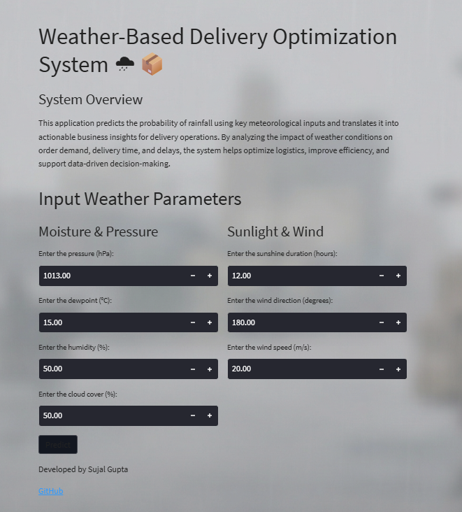

)
🌧📦 Weather-Based Delivery Optimization System

A business-focused analytics system that predicts rainfall and converts it into actionable delivery optimization strategies.

👉 Built to answer not just “Will it rain?”
👉 But “What should operations do about it?”

🚀 Key Business Impact
📈 Order demand increases by ~40% during high rainfall
⏱ Delivery time increases by ~75% under adverse weather
⚠️ Delay rate doubles in heavy rainfall conditions
🚚 Enables proactive fleet allocation and inventory planning

🎯 Problem Statement

Delivery operations are highly sensitive to weather, especially rainfall.

Most systems only provide forecasts but fail to answer:

How will demand change?
What happens to delivery performance?
What actions should be taken?

👉 This creates a gap between prediction and decision-making

💡 Solution Overview

This system bridges that gap by combining:

🌧 Rainfall Prediction Model
📊 Simulated Delivery Operations Dataset
📦 Operational Impact Analysis
🚀 Decision Recommendation Engine
🖥 Interactive Streamlit Dashboard

👉 Result: A complete pipeline from prediction → insight → action

⚙️ Core Features
🧠 ML Prediction Engine
Predicts rainfall probability using meteorological inputs
Uses calibrated model with optimized threshold
Provides reliable probabilistic outputs
📦 Operational Impact Insights

Transforms weather predictions into:

Order demand changes
Delivery time variation
Delay rate fluctuations

👉 Enables understanding of real-world operational impact

🚀 Decision Recommendation System

Generates actionable strategies:

Increase delivery fleet during high rainfall
Adjust ETAs dynamically
Pre-stock inventory for demand spikes

👉 Moves beyond analysis → business action

📊 Data-Driven Metrics
Metrics dynamically computed from dataset
No hardcoded assumptions
Ensures realistic and explainable outputs
🎨 Interactive Dashboard
Built with Streamlit
Clean UI with optimized background and readability
Structured insights + decisions in one interface
📊 How It Works
1️⃣ Input Layer

User provides:

Pressure
Dewpoint
Humidity
Cloud Cover
Sunshine
Wind Direction
Wind Speed
2️⃣ Prediction Layer
Data is scaled
Model predicts rainfall probability
Compared with optimized threshold
3️⃣ Business Logic Layer
Rain Probability	Operational Impact
Low	Stable operations
Medium	Moderate disruption
High	Demand surge + delays
4️⃣ Insight Generation

System computes:

Avg Orders
Delivery Time
Delay %
5️⃣ Decision Engine

Outputs:

Fleet allocation strategy
Delivery time adjustments
Inventory planning recommendations
📈 Machine Learning Overview
Random Forest-based model
Feature scaling applied
Model calibration for probability accuracy
Threshold tuning for optimized performance
🧰 Tech Stack
Category	Tools Used
Frontend	Streamlit
Language	Python
ML Framework	Scikit-learn
Data Processing	Pandas, NumPy
Visualization	Matplotlib
Model Storage	Joblib
Deployment	Docker (planned)